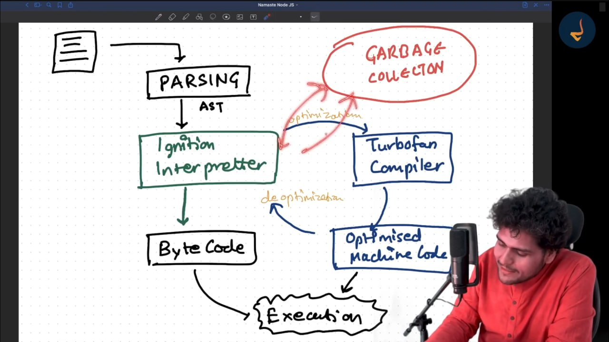
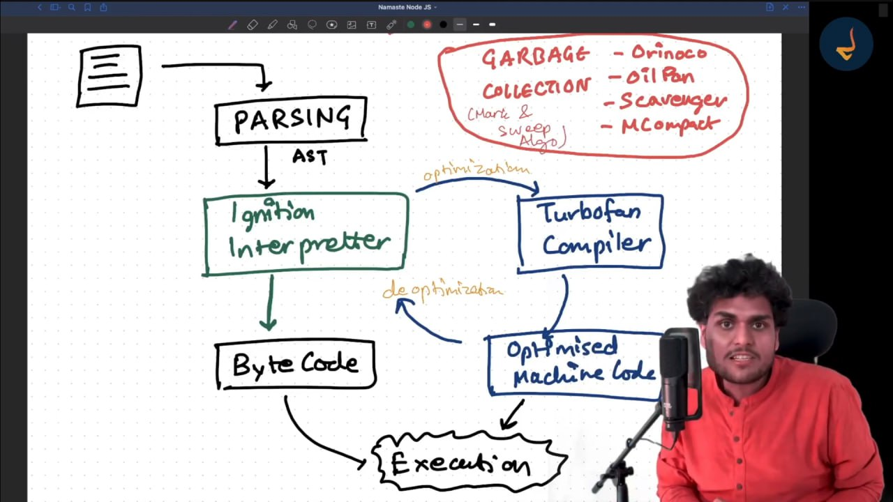
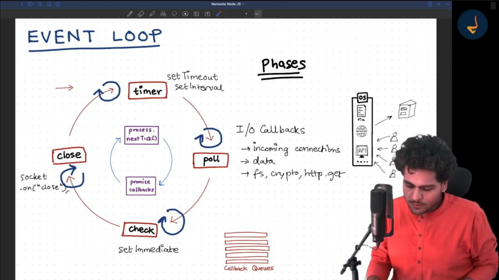

## express --no-view . OR npx express-generator

```javascript
globalThis === global;
```

#### How are vairbale and fucntions private in different modules?

-> IFFE

#### How do ypu get access of module.exports

-> Nodejs passes multiple parameters in IIFE and module.exports is one of them

#### How Require function works

- Resolution of the Module
- Load the module
  - file contents is loaded according to the file type
- Compile
  - Wrap inside IIFE
- Evaluation i.e passing params
- `Caching`

#### File ---> wrap the file with IIFE ---> passing it to V8 Engine

### Modules are protected by default and it is use to protect their variables and functions from leaking

### Libuv is `C Library` just use to Async I/O operations made simple

### Require function works in synchronous mode when working with the common js

## Async task management by Libuv

- Donot use the sync method it will going to block the Main thread instead use the async method thease task send to LIBUV
- Timer queue uses min heap tree

## Node js is asynchronous but the V8 engine is synchronous

#### Code Execution in V8

- Code
- Parsing
  - Lexical Analysis [Tokenization]
    - Code token
  - Syntax Analysis [Parsing]
    - AST(Abstract Syntax tree) [Website Example](https://astexplorer.net/)
      when code doesnot generate the AST then it throws the error like syntax error
- Ignition Interpreter
  - Convert the code into the byte code
    - Execution
  - Turbofan compiler (get HOT code from interpreter)
    - Optimise machine code
      - Execution




### Event loop

- Perfrom in cyclic manner

  - Timer [setTimeOut, setInterval]
  - Poll [I/O Callbacks like fs, crypto,http]
  - Check [setImmediate]
  - Close [socket.on("close")]

- But before all the above phase `process.nextTick()` and `promise.callback()` run for each and every phase and both have highest priority
- When nothing to perform in the Event Loop then it wait in the `Poll Phase` and then continue from the poll phase itself
- One cycle of the event loop is called `Tick`
  

### Thread Pool

- By default there are 4 threads in the pool but user can able to change the size of the pool by using the variable `process.env.UV_THREADPOOL_SIZE`
- Is Nodejs is single threaded or multithreaded ?
  - It depends on the task user is doing. If the user is performing synchronous tasks then nodejs is single threaded and the task is asynchronous then nodejs is multithreaded
- thread pool is created by using Libuv and it is used when `fs`, `dns.lookup`, `crypto.pbkdf2` or any kind of `user specified input` then it is using thread pool
- `Thread per connection` is not an good idea (creatting a thread for each connection)

#### `There are events occur in the kernel level which notify's to the libuv to perform the task, thats why it called event driven architecture`

### Database

- It is organized collections of the data
  

## Middleware is nothing but the initial checks before the actual execution of the function.

## app.use(express.json()) is use for getting body object whenever the post request is made.

- Program in running state is called process

---

## Thread

- In nodejs Thread is swpan(start) by the `process` it it best to use thread instead of process it ti light weighted it take memory from the process and it is faster than running the `process`
- we can create thread by using

### If you are using express and create routes using app.use() then the scquence of the routes are matters like

```js
app.use("/", (req, res) => {
  res.send("You are doing something which actually very great!");
});

app.use("/test", (req, res) => {
  res.send("Your test");
});
```

- Above code give me same `You are doing something which actually very great!` for every routes

```js
app.use("/test", (req, res) => {
  res.send("Your test");
});
app.use("/", (req, res) => {
  res.send("You are doing something which actually very great!");
});
```

- but this code give me exact output as we expect

### If you use the app.use()then it will match all the http methods

```js
app.use(
  "/",
  (req, res, next) => {
    // res.send("Main Dashboard");
    next();
  },
  (req, res, next) => {
    res.send("Main Dashboard");
  }
);
```

#### we can use regular expressions as well while declaring the routes for example `?, +, *, ()` e.g : `/ab?c` --> `/abc & /ac` ; `/ab+c` --> `/abbbbbbbbbbbbbbc` any no of b ; `/ab*c` --> `/abWRITEANYTHINGc`;

### `Request  --> Middleware chains --> request handler`

#### Handle the error gracefully by using

```javascript
// kind of wildcard match
app.use("/",(err,req,res,next))=>{
  if(err){
    res.status(500).send("Something went wrong!!");
  }
}
```

below every routes

**When we pass anything in the body we cannot directly readt the data because it in json formate for that use `app.use(express.json())` above all request so that it can be use for all the request**

**NEVER TRUST req.body Always Put Checks to Sanitize the data don't put blindly anything into the DB**

### Any other data in the body which is apart from the `defined` model/ schema will not be added in your DB

#### You can create hash using `bcrypt.hash(password, 10);` to compare if the password is matching or not use the `bcrypt.compare` function which return Boolean value and it return promises ` i.e bcrypt.compare(password, user.password);`

#### To get the cookie use the package called `cookie-parser` , its like middleware which parses the cookies

#### To create Token use `jsonwebtoken`. Tokenn can be created using `jwt.sign()` and `jwt.verify()` which verify the user is authentic or not

### -------------------------------------------------------

# CMD IMP Commands

### `source` `ps1` `echo`

```javascript
const { Worker } = require("worker_thread");
new Worker("./worker.js");
```

- when the process is started then the process having atleast one default thread called Main thread at the time of stating
- Node.js is mainly single-threaded, running JavaScript on a single thread with an event loop, ideal for I/O-bound tasks. However, it can be multi-threaded using libuv's thread pool for background tasks and the worker_threads module for parallel execution, allowing it to handle CPU-intensive tasks while keeping the main event loop single-threaded.

<h3>Concurrency</h3>
<h3>Parallelism</h3>

### we can create new environment variable by using `export VAR_NAME = VALUE` it will run and saved in env by running this program but to read the value from the env use `process.env` and assign in another variable

# child_process

- To Execute any command in Nodejs we have to use

```javascript
const { exec } = require("child_process");
exec("Command_NAME_TO_EXECUTE");
```

## Intro to common js module system

- It is synchronous in nature

## Module.exports vs exports

```javascript
module.exports === exports; // true
```

## Module Wrapper function (IIFE)

nodejs uses iife to wrap the whole function

```js
(function (exports, require, module, __filename, __dirname) {
  // Your module code here
})(exports, require, module, __filename, __dirname);
```

### `thats why the scope of the nodejs file is local scope and`

you can even write "use strict" inside the function as well

# custom required function

- we can create custom functions to replace the require function but using require function🫠.
- Internally nodejs uses cpp code to require and the files but we can use required function for demonstration purposes

### to execute the string use the `eval` function

### If you use common js then only the `Localscope` can be created if you use Es6 Module then instead of local scope the module scope is created

### common js me file name extension me koi validation nahi but Es6 modules me hai

### `import.meta` is whole one property which return whole new object and it is accessible only when using Es6 Module

in the latest version of nodejs or from 20 you can see multiple properties but before that if you use import.meta then you only get `url` property inside the import.meta but after 20 you can see multiple properties like `filename` dirname`and`resolve ` property and you can also add your own properties customized properties

- `dirname` give the directory from where the code is running
- process.cwd() give the current working directory

# Difference between common js and ES6 modules

- Common js

  - Load file Synchronously
  - cjs import are hoisted
  - we cannot use `await` keyword without using async function we have to wrap it first using IIFE if needed(top level await is not allowed)
  - Only one value can be exported
  - File Extension is optional(if we give full path the we can load any file using cjs)
  - value of `this` keyword is equal to/ points to the module.exports property
  - we can get file name using \_\_filename
  - strict mode is not enabled by default

- ES6 modules
  - Load file Asynchronous
  - mjs import are hoisted
  - we can use `await` keyword without using async function(top level await is allowed)
  - Multiple value can be exported
  - File Extension is mandatory( only js and mjs files are allowed)
  - set type= module inside the package.json file to use ES6 modules
  - value of `this` keyword is undefined
  - we can get file name using import.meta.filename
  - strict mode is enabled by default

```javascript
export default !== module.exports
export !== exports
```

## NPM Modules

- Those modules which are present inside the npm_modules are called npm modules

## Understand package.json file in depth

node has its own built-in module which replace the nodemon you can use `--watch` flag
`node --watch app.js`

### dev dependencies are the dependencies which where no needed after built the file means in the buit folder it doesn't include as well it is needed for development environment only not for production

## shebang `#!` `/usr/bin/env`

- it is for unix OS only

## cli vs library package

- `.bin` is special kind of function created when using cli packages(Most of the time)

### NPX

#### How NPX works?

- it seaches for a file and executes it.

##### Search step 1

- first searches for package.json file in current working directory
- seaches for name key in json file
- after that seaches for bin key

##### Search step 2

- searches for node_modules/.bin/${YOUR_SEARCHTEXT} file in current working directory and executes

##### Search step 3

- searches for global npm folder `npm root -g` and executes

##### Search step 4

- for npx cache

##### Search step 5

- searches for ${YOUR_SEARCHTEXT} package in npm registory and give prompt to install or not and then download if allowed and executes it if it is executable and if not then give error

#### At the end NPX is just and simple javascript file

## FS Module

```js
import fs from "fs";
import fs from "node:fs";
```

better to use fs module from `node:fs/promises` this is use to return a promise and it is best way to use fs module
and it does not block the main thread, it also help to boost performance
and it is similar syntax as readFileSync

### writeFile

```js
writeFile("PATHNAME", "CONTENT TO WRITE");
```

it overrides content with current content

```js
appendFile("PATHNAME", "CONTENT TO WRITE");
```

it doesn't overrides content with current content

### Rename

- You can rename the file using fs.rename method and to move the file you can also use the same method

#### [For More](https://nodejs.org/docs/latest/api/fs.html)

##### Octal No

- It can be denoted by `o` e.g `0o12` or in previous version we can also represented by `012`

##### Hexadecimal No

- It can be denoted by `x` e.g `0x12`

##### Binary No

- It can be denoted by `b` e.g `0b12`

##### If you wanted to debug the nodejs code into the browser use `--inspect-brk` flag to and then name of the file
